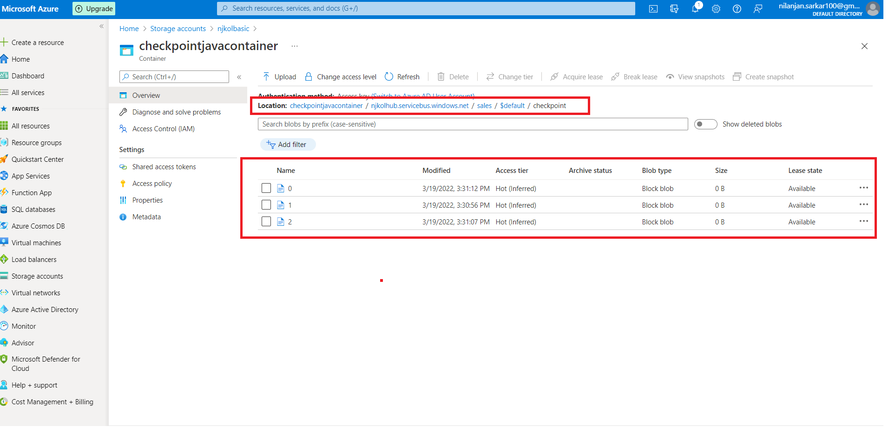

# Azure EventHub Consumer

* You'll use Azure Storage Blob Storage as the checkpoint store. Checkpointing is a process by which an event processor marks or commits the position of the last successfully processed event within a partition.

* Marking a checkpoint is typically done within the function that processes the events. 

## Create a Blob container for checkpointing

```cmd
az storage container create ^
    --account-name %STORAGE_ACCOUNT_NAME% ^
    --name checkpointjavacontainer ^
    --auth-mode key ^
    --account-key <your_key>
```

## Checkpoint data on Azure blob store




## References

https://docs.microsoft.com/en-us/azure/event-hubs/event-hubs-java-get-started-send#create-an-azure-storage-and-a-blob-container

https://docs.microsoft.com/en-us/azure/event-hubs/event-processor-balance-partition-load

